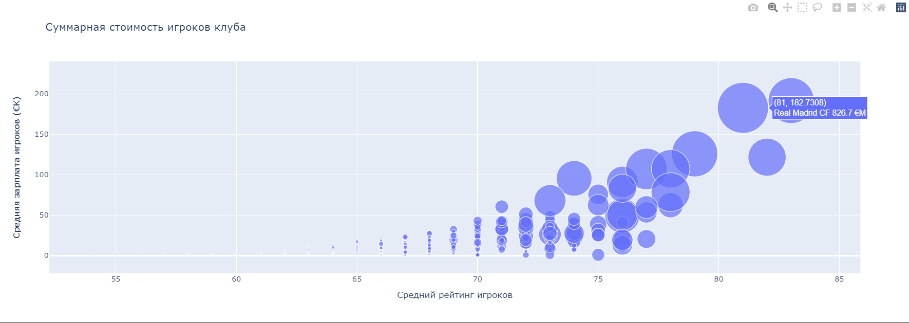
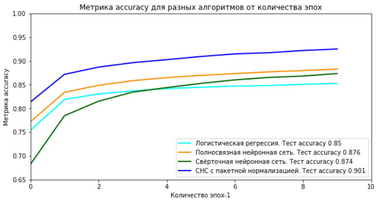
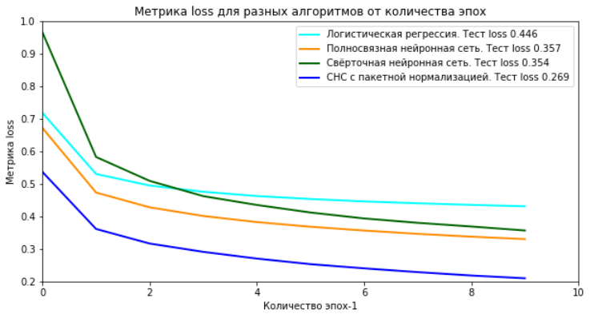

# Portfolio
Portfolio 2021, 2022 years

#Python

<!--
# Python
-->

##Игра 15

<!--
## Игра 15
-->
Простая игра в 15. 
Минимальный графический интерфейс позволяет
сохранить/загрузить позицию из файла, сгенерировать случайную
позицию, выбрать цвет и шрифт кнопок. Управление кликом мыши.

##Скринсейвер

<!--
## Скринсейвер
-->
Второе задание второй недели курса Погружение в Python МФТИ на Coursera.
Описание управления - F1.

Демо gif.

<!-- 
# Python и C

## C из Python

## Python из C
-->

#WEB Django

<!--
# WEB Django
-->

#Machine Learning

<!--
# ML
-->

##Диаграммы по DataSet FIFA

<!--
## Диаграммы по DataSet FIFA
-->
Первое задание второй недели курса Python для анализа данных МФТИ на Coursera.
coursera_ds.yml - настроечный файл среды в Anaconda.

##Курсовой по нейронным сетям

<!--
## Курсовой по нейронным сетям
-->
Курсовой проект курса Python для анализа данных МФТИ на Coursera.
Задание на проект - файл Задание.docx.
coursera_tf_38.yml - настроечный файл среды в Anaconda. TensorFlow критичен к версиям остального ПО.
Ссылка на dataset: 
https://www.kaggle.com/datasets/zalando-research/fashionmnist/download?datasetVersionNumber=4

Результаты: 

##Обработка dataset с Caggle

<!--
## Обработка dataset с Caggle
-->

