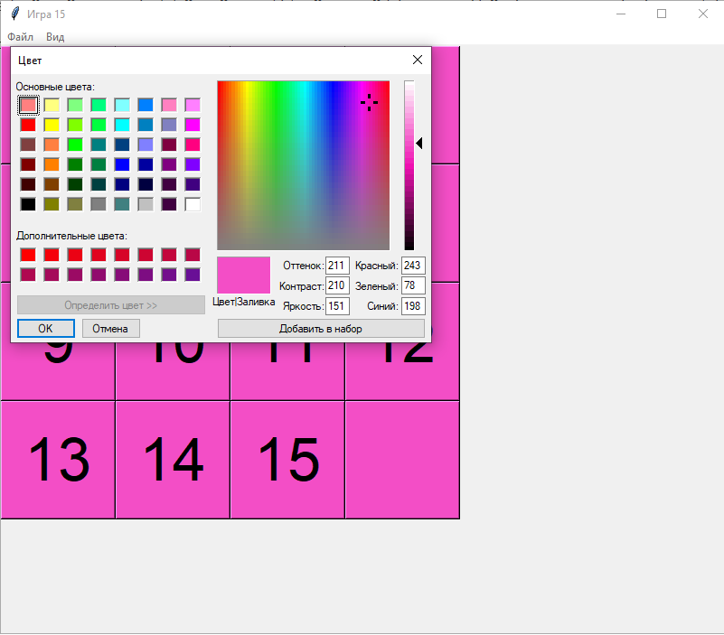
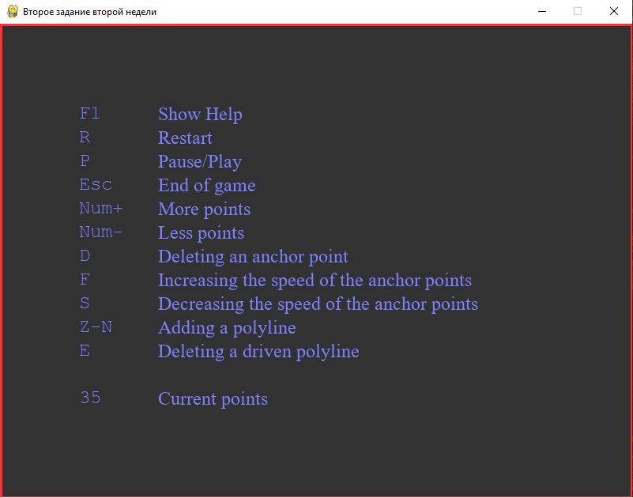
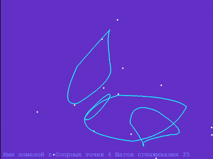

# Portfolio
Portfolio 2021, 2022 years

# Python

## Игра 15
Простая игра в 15. 
Минимальный графический интерфейс позволяет
сохранить/загрузить позицию из файла, сгенерировать случайную
позицию, выбрать цвет и шрифт кнопок. Управление кликом мыши.

## Скринсейвер
Второе задание второй недели курса Погружение в Python МФТИ на Coursera.
Описание управления - F1.

Демо gif.

<!-- 
# Python и C

## C из Python

## Python из C
-->
# WEB Django

# ML
## Диаграммы по DataSet FIFA

## Курсовой по нейронным сетям

## Обработка dataset с Caggle